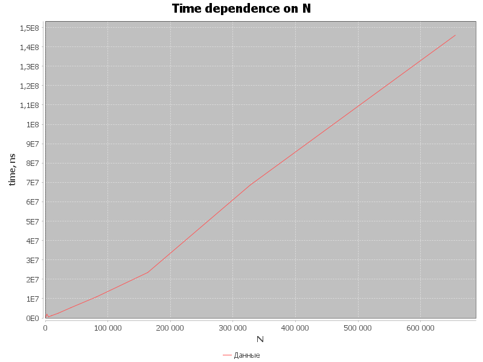

# nth_element
Алгоритм поиска n-го элемента на Java с использованием метода IntroSelect

## Запуск
`git clone`

`mvn test` - запуск бенчмарков и стресс тестов

## Структура проекта
Проект содержит один утилитный класс `SortingAlgorithms`, в котором есть один публичный статический метод `SortingAlgorithms.nthElement(T[] arr, int n)`
Метод ставит на позицию n в массиве arr тот элемент, который должен был бы стоять там, если бы массив был отсортирован.
Как видно, метод работает с параметризованным типом T, который должен наследовать класс Comparable. Это необходимо для попарного сравнения элементов.

## Анализ результатов
Для более точного анализа производительности кода производится несколько прогревочных операций, которые дают время оптимизировать код JIT. Затем несколько раз запускается алгоритм, результаты по времени усредняются.

Бенчмарки показывают, что на одних и тех же численных данных на отсортированном и неотсортированном массивах процедура работает за сопоставимое время. Такой результат достигается за счет гибридного алгоритма в методе IntroSelect.

Benchmark 1 (Random distribution)
SIZE=100000; N=50000;16267990 nanoseconds
-----------------------------------------
Benchmark 2 (sorted array)
SIZE=100000; N=50000;18810270 nanoseconds

